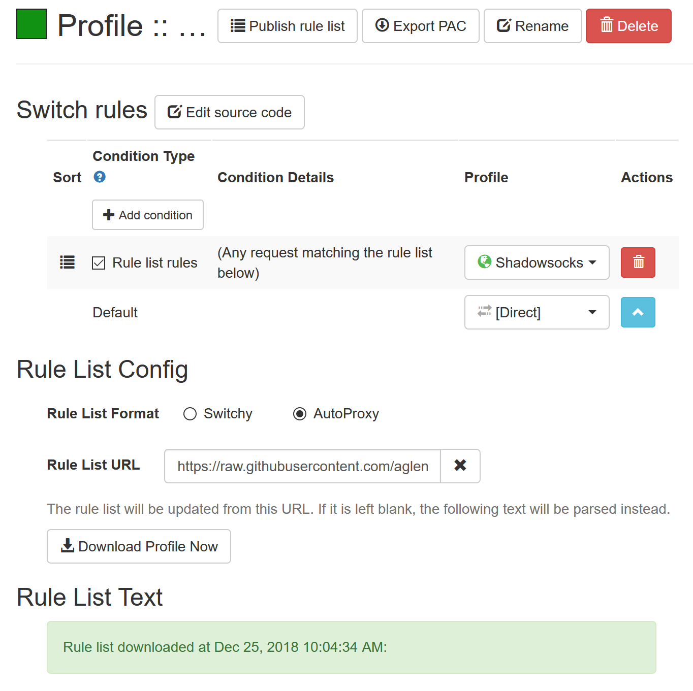

# AutoProxy格式的自动切换规则

这是自用的自动代理规则列表

黑名单gfwlist.pac来源  https://github.com/gfwlist/gfwlist

白名单whitelist.pac来源 https://github.com/neko-dev/gfw_whitelist

本人在黑名单基础上增加了一部分规则 在白名单的基础上增加了一部分国内CDN域名和常用域名（白名单只提供常用网站）

使用方法：

1.黑名单模式

SwitchyOmega扩展里新建switch profile模式（适用于Firefox 57+和Chrome）

规则列表地址填入 https://git.io/gfw-list 或 https://raw.githubusercontent.com/aglent/autoproxy/master/gfwlist.pac 格式选择 autoproxy

2.白名单模式

SwitchyOmega扩展里新建switch profile模式（适用于Firefox 57+和Chrome）

规则列表地址填入 https://git.io/whitelistpac 或 https://raw.githubusercontent.com/aglent/autoproxy/master/whitelist.pac 格式选择 autoproxy

# 中国国内IP白名单代理规则

使用方法：

SwitchyOmega扩展里新建pac profile模式（适用于Chrome），填写PAC URL：https://git.io/chinaip 。

IP段会不定期更新。

# -----------------------------------------------------------------
介绍一个自己在用的稳定快速的工具 [YoYu](https://home.yoyu.ltd/aff.php?aff=447) 链接内有aff 如有介意 自行输入url

电信500M宽带实际测速 [专线] -> 200-300Mbps   [BGP] -> 200-400Mpbs   [日用] -> 50-100Mbps
